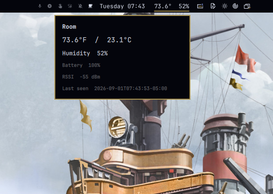

# Room

Indoor temperature and humidity on the Omarchy bar, from a local SwitchBot meter over Bluetooth LE. No cloud, no hub.



The pill sits in the **center** of the bar and shows something like `73.6°  52%`. Click it for both units, humidity, the last-hour trend, battery, RSSI, and last-seen. A dimmed pill means the last reading is older than two minutes.

Works with SwitchBot Meter, Meter Plus, Indoor/Outdoor Meter, Meter Pro, and Meter Pro CO2. One meter per install.

## Install

```bash
omarchy plugin add https://github.com/novique-ai/omarchy-room-sensor.git --enable
```

That clones the plugin into `~/.config/omarchy/plugins/novique.room/` and places **Room** in the center of the bar. Then install the local BLE reader (Python venv + user systemd unit, no sudo):

```bash
~/.config/omarchy/plugins/novique.room/install.sh
```

On a TTY with no meter bound yet, the installer scans for about 20 seconds and asks which MAC to use. If you already have `~/.config/room-sensor/config.json`, that address is kept.

## Bind a meter

```bash
room-temp --discover
room-temp --bind AA:BB:CC:DD:EE:FF
```

No pairing and no SwitchBot hub. The meter must be powered and in range.

## Use

| Action | How |
|---|---|
| Read | Look at the bar: `73.6°  52%` |
| Details | Click the pill — includes `+0.9°F in the last hour` and a sparkline |
| Notify | Right-click the pill |
| CLI | `room-temp` |
| Trend | `room-temp --since 1h` |

## Settings

| Setting | Default | Meaning |
|---|---|---|
| Temperature unit | `F` | Pill unit. The panel always lists °F and °C. |
| Stale after | `120` seconds | Dim the pill when advertisements stop. |
| Room name | empty | Panel title. Blank uses the meter model. |
| Show humidity on the pill | on | Hide it if you want a shorter pill. |

Move the pill if you want it somewhere else:

```bash
omarchy bar move novique.room --section right
```

## History

The reader keeps a rolling log of samples at `~/.local/state/room-sensor/history.jsonl`,
one compact JSON object per line and at most one a minute.

```bash
room-temp --since 1h
room-temp --since 6h --json
```

`45s`, `90m`, `2h`, `3d` and `1h30m` all work; a bare number means minutes.

```
Last 1h — 61 samples, 06:08 → 07:08

Temperature: 73.2°F → 74.1°F  (+0.9°F / +0.5°C)
             min 73.0°F  max 74.3°F  avg 73.6°F
             ▁▂▂▃▄▄▅▆▆▇█

Humidity:    52% → 50%  (-2%)
             min 50%  max 52%  avg 51%
             ██▇▆▅▄▃▂▁▁▁
```

Recording is on by default and costs roughly a megabyte a week. Old rows are pruned on
startup and as the file grows. Tune it in `~/.config/room-sensor/config.json`:

| Key | Default | Meaning |
|---|---|---|
| `history` | `true` | Record samples at all. |
| `history_interval_seconds` | `60` | Minimum gap between recorded samples. |
| `history_retention_hours` | `168` | Drop rows older than this. |

It is plain JSONL, so `tail`, `jq`, and `rm` all behave the way you would expect.

The reader also writes a `trend` block (last hour) into `status.json` so the details
panel does not have to parse the JSONL. If you turn the optional status server on
(`"http": true` in `config.json`), the same summary as `room-temp --since 1h --json`
is at `http://127.0.0.1:18787/history?since=1h`. A bad duration is HTTP 400.

## Remove

```bash
omarchy plugin remove novique.room
```

That only drops the bar plugin. To stop the reader:

```bash
~/.config/omarchy/plugins/novique.room/install.sh --uninstall
```

Add `--purge` to also delete config, last reading, and the venv.

## Requirements

Omarchy Quattro, a Bluetooth adapter, Python 3, and one supported SwitchBot T/H meter.

## Develop

```bash
node --test tests/*.test.js
python -m unittest discover -s sensor -v
omarchy plugin validate .
```

Edits under `~/.config/omarchy/plugins/novique.room/` reload the QML in the running shell. After changing `sensor/room_sensor.py`, re-run `install.sh` and `systemctl --user restart room-sensor.service`.
